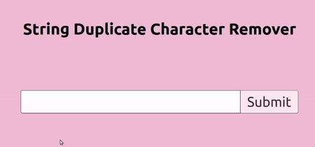
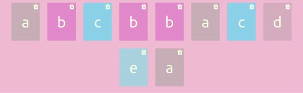

# Duplicate Character Remover

Visually remove duplicate characters in a string using generated cards

Github Octernship assignment for [houseware.io](https://www.houseware.io). [Learn More](https://education.github.com/students/octernships)

## How to use

Enter a string



Click a character card's delete icon to remove the duplicates




## Available Scripts
### `npm start`

Runs the app in the development mode.\
Open [http://localhost:3000](http://localhost:3000) to view it in the browser.

The page will reload if you make edits.\
You will also see any lint errors in the console.

### `npm run build`

Builds the app for production to the `build` folder.\
It correctly bundles React in production mode and optimizes the build for the best performance.

After building the application, you may serve it with a static server:
```bash
$ npm install -g serve
$ serve -s build
```

See the section about [deployment](https://facebook.github.io/create-react-app/docs/deployment) for more information.

## Learn More

This project was bootstrapped with [Create React App](https://github.com/facebook/create-react-app).

[React documentation](https://reactjs.org/).

[Create React App documentation](https://facebook.github.io/create-react-app/docs/getting-started).